## 1- we installed "aws configure" by this : 

curl "https://awscli.amazonaws.com/awscli-exe-linux-x86_64.zip" -o "awscliv2.zip"

unzip awscliv2.zip

sudo ./aws/install


## 2- write aws configure in root of project to access the account 
## 3- create IAM user in aws cloud account with admin permissions , and get access key

## 4- write the access key & secret access key in "aws configure" to access the accounts 


## 5- We start with building the ECRs -> 3 repos for 3 services : 

- ocr-gateway
- ocr-character-service
- ocr-word-service

## 6- then build the 3 images locally with docker like this : 

- ocr-gateway : 

**docker build --platform linux/amd64 -t ocr-gateway -f gateway/Dockerfile .** 

linux/amd64 , this because aws runs on intel/amd processors , If you are on a modern Mac or some Linux setups, your computer might build "ARM" images by default. Without this flag, your container would crash on AWS with an "Exec format error."


- then tag the image : 

docker tag ocr-gateway:latest 470895881101.dkr.ecr.eu-north-1.amazonaws.com/ocr-gateway:latest 

because we must re-label the image , not only ocr-gateway 


- then push the image : 

docker push 470895881101.dkr.ecr.eu-north-1.amazonaws.com/ocr-gateway:latest 


, and you will see the image in the ECR on the cloud ... , fine .


##### break : 

- 470895881101.dkr.ecr.eu-north-1.amazonaws.com/ocr-gateway:latest
 
 - 470895881101 : Account ID
 - dkr.ecr  : docker ECR 
 - Region : eu-north-1
 


## we will do the same with other services : 

-- word service :  
- doas docker build --platform linux/amd64 -t ocr-word-service -f classifier/word-classifier/Dockerfile .

-- character service : 
- docker build --platform linux/amd64 -t ocr-character-service -f classifier/character-classifier/Dockerfile .


## 7- create Security groups 

## 8- create ALB ( Application Load Balancer ) security Group


- Steps : \
1- Open VPC on aws cloud \
2- Go to Security Groups \
3- Create new security Group 


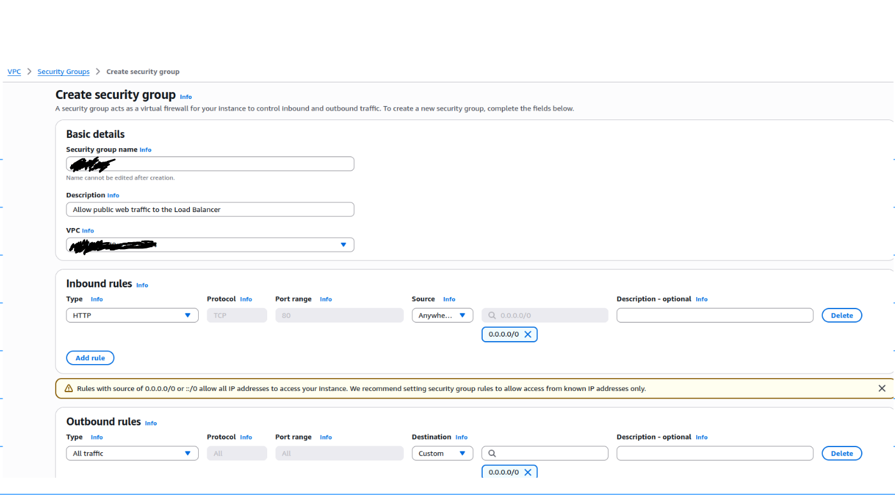


1. Create the ocr-alb-sg (The Front Door)
   * Security group name: 
   * Description: "Allow public web traffic to the Load Balancer"
   * VPC: (Keep the default one selected)
   * Inbound rules:
       * Type: HTTP
       * Port range: 80
       * Source: Anywhere-IPv4 (This will automatically fill in 0.0.0.0/0)
   * Outbound rules: Leave as-is (Allow all).
   * Click "Create security group" at the bottom.


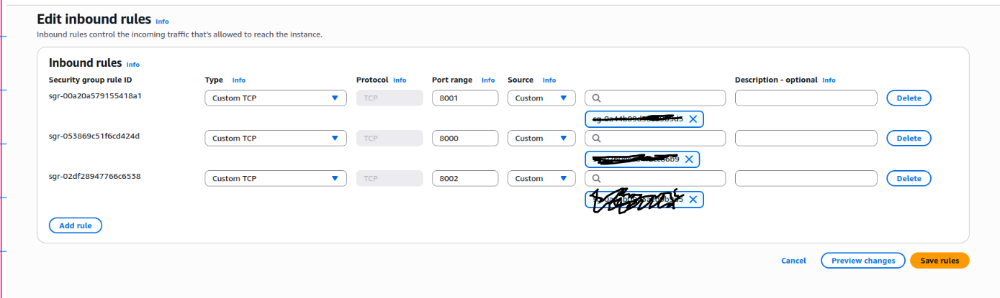

  2. Create the ocr-tasks-sg (The Container Protection)
   * Security group name: ocr-tasks-sg
   * Description: "Allow traffic from ALB and internal microservice communication"
   * VPC: (Keep the default one selected)
   * Inbound rules: (Add 3 rules)
       1. Rule 1:
           * Type: Custom TCP
           * Port range: 8000
           * Source: Search for and select ocr-alb-sg (the one you just created).
       2. Rule 2:
           * Type: Custom TCP
           * Port range: 8001
           * Source: Search for and select ocr-tasks-sg (it can refer to itself!).
       3. Rule 3:
           * Type: Custom TCP
           * Port range: 8002
           * Source: Search for and select ocr-tasks-sg.
   * Outbound rules: Leave as-is (Allow all).
   * Click "Create security group".


## Now : 
 Summary of Secure Architecture so far:
   * Port 8000 accepts traffic ONLY from the ALB.
   * Ports 8001 and 8002 accept traffic ONLY from within the Task group


## SECURITY NOTES : 

   * The **ALB** can only talk to the Gateway (Port 8000).
   * The **Gateway** can talk to the **Character/Word** services because they are all inside the same ocr-tasks-sg.
   * The most **important** part: Nobody from the outside can talk to Port **8001** or **8002** directly. They must go through your **Gateway**.


---
## 1. The High-Level Architecture
```text
[ USER BROWSER ]
      |
      v (Port 80 - HTTP)

+-------------------------------------------------------------+
| AWS CLOUD (eu-north-1)                                      |
|                                                             |
|  [ Application Load Balancer (ALB) ] <--- Protected by ocr-alb-sg
|           |                                                 |
|           v (Port 8000)                                     |
|                                                             |
|  +-------------------------------------------------------+  |
|  | VPC (Virtual Private Cloud)                           |  |
|  |                                                       |  |
|  | [ ECS FARGATE CLUSTER ] <--- Protected by ocr-tasks-sg|  |
|  |        |                                              |  |
|  |        +--> [ Container 1: Gateway ] (Port 8000)      |  |
|  |        |      |                                       |  |
|  |        |      +-- requests --> [ Container 2: Char ]  |  |
|  |        |      |                (Port 8001)            |  |
|  |        |      |                                       |  |
|  |        |      +-- requests --> [ Container 3: Word ]  |  |
|  |        |                       (Port 8002)             | |
|  |        +----------------------------------------------+  |
|  +-------------------------------------------------------+  |
|                                                             |
|  [ Amazon ECR ] <--- (Where your Docker images live)        |
|   - ocr-gateway                                             |
|   - ocr-character-service                                   |
|   - ocr-word-service                                        |
+-------------------------------------------------------------+
```
  ---

  ## 2. How the Components Work Together

  A. Docker & ECR (The Storage)
   * Your code is packaged into Docker Images.
   * We used --platform linux/amd64 to make them compatible with AWS.
   * The images are stored in Amazon ECR. When AWS starts your app, it pulls the images from here.

  B. The Load Balancer (The Traffic Controller)
   * The ALB provides a single URL for the user.
   * It performs Health Checks: If the Gateway container crashes, the ALB stops sending traffic to it and waits for a new one to start.

  C. ECS Fargate (The "Serverless" Computing)
   * Fargate means you don't manage actual servers (EC2). AWS manages the hardware for you.
   * Tasks: Each container is called a "Task."
   * Services: We create an ECS "Service" for each container. The Service ensures that at least 1 copy of your app is always running.
   * Auto-Scaling (ASG): If your doctor wants to see scaling, we set a rule: "If CPU usage > 70%, start a second Word Service container."

  D. Security Groups (The Firewalls)
   * ocr-alb-sg: Only allows traffic from the internet on Port 80.
   * ocr-tasks-sg: Only allows traffic to Port 8000 from the ALB. It blocks everything else from the outside.

  E. Service Discovery (The "Internal Phonebook")
   * Because containers change IP addresses every time they restart, we use AWS Cloud Map.
   * Your Gateway code will call http://word-service.ocr.local:8002 instead of an IP address. AWS will automatically point that name to the correct container.


# 9- Create Cluster ECS -> Elastic Cluster Service : 
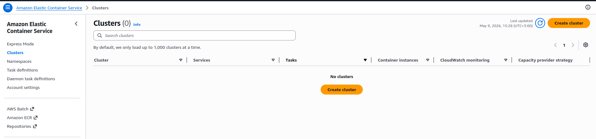

  Think of an ECS Cluster like a Managed Hotel for Containers.

  1. The Logic: A Cluster is a "Container Neighborhood"
  A cluster is simply a logical grouping. It doesn't actually cost money to have a cluster; it's just a way for AWS to organize your resources. 
   * In your ocr-cluster, you will have 3 "Guests" (Your 3 microservices).
   * The cluster keeps them together so they can share the same network, security rules, and monitoring.

  2. The Infrastructure: Fargate (The Magic Part)
  There are two ways to provide the "land" for your hotel:
   * EC2 Mode: You buy the land and build the hotel yourself (You manage the servers).
   * Fargate Mode (What we are using): You just tell AWS, "I have a guest coming," and AWS instantly builds a temporary room for them. When the guest leaves, AWS destroys the room. 
       * Benefit: You don't have to worry about updating Linux, patching security on the server, or running out of disk space on the "host."

  3. The Hierarchy (How it fits together)
  To explain it to your doctor, use this hierarchy:

   1. Cluster: The "Neighborhood" (ocr-cluster).
   2. Service: The "Manager" for a specific container (e.g., the gateway-service). The Service's job is to make sure your container stays alive. If it crashes, the Service starts a new one automatically.
   3. Task Definition: The "Blueprint." This is a file that tells AWS: "Use the image from ECR, give it 1GB of RAM, and open Port 8000."
   4. Task: The actual "Running Container." When a Task Definition is executed, it becomes a "Task."

  4. Why do we need it?
  Without a cluster, you would have to manage individual containers manually. The cluster allows you to:
   * See everything in one dashboard.
   * Apply Scaling: "I want 5 copies of the Word Service in this cluster."
   * Service Discovery: It allows the containers to find each other by name (e.g., word.ocr.local).


## To create cluster , the web-app-docker-admin should have permissions to that : 

1- Go to IAM \
2- Go to IAM Users \ 
3- click on **web-app-docker-admin** \
4- click on **add permissions** \
5- click on **attatch policies directly** \
6- then add these **permissions** :
- mazonECS_FullAccess (To manage the cluster)
- AmazonVPCFullAccess (To manage the networking)
- AmazonElasticLoadBalancingFullAccess (To manage the ALB)


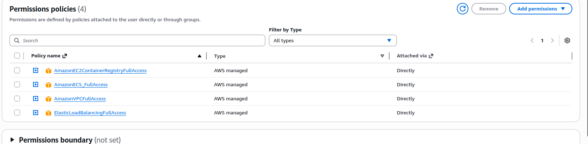


## Load Balancer : 
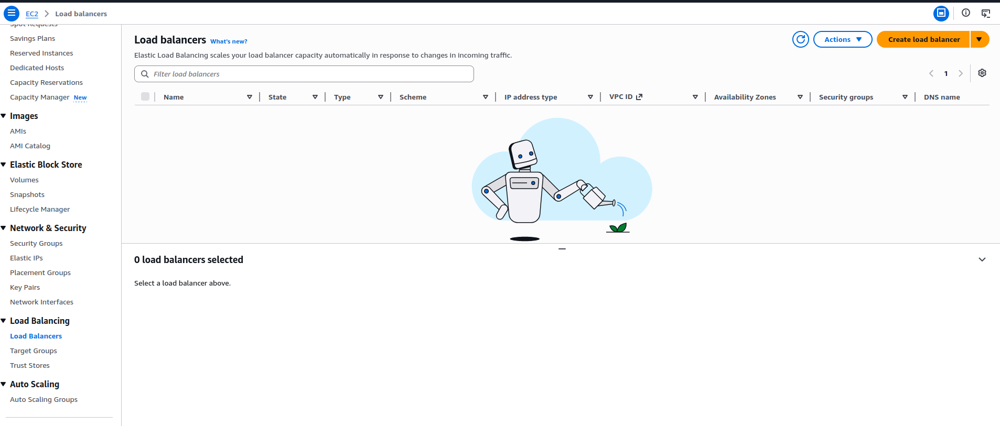


### Application Load Balancer : 
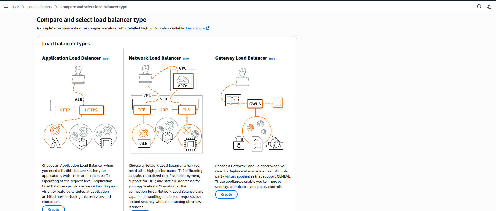


### we need target Group first for this : 

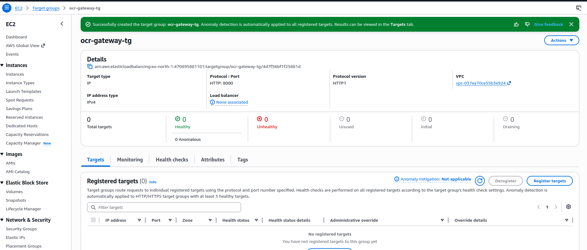


## Then name & Choose your Target Group & VPC security for ocr-alb : 
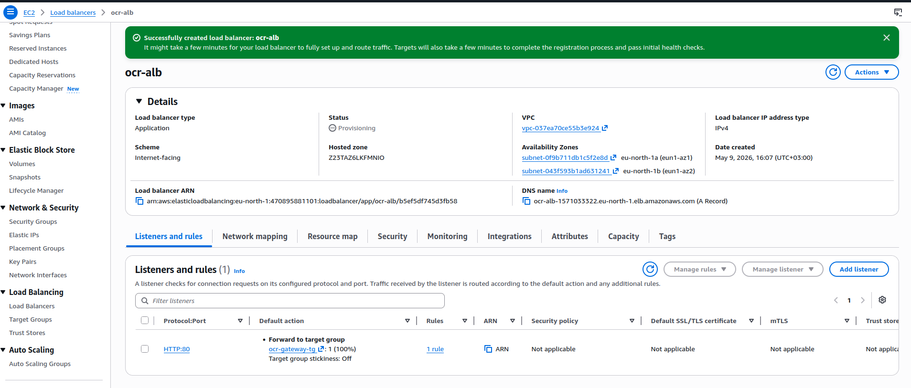


## **Phase 4** : Service Discovery (The Final Bridge)
  Before we can run the code, we need to create the **Namespace**. This is what allows the Gateway to find the Word Service and Character Service by name inside the private network.

   1. Go to the ECS Console.
   2. On the left sidebar, click Namespaces.
   3. Click Create namespace.
   4. Namespace name : ocr.local
   5. Instance discovery: Select API calls and DNS queries in VPCs.
   6. VPC: Select your default VPC.
   7. Click Create.


-- i enabled to create it from UI , so i did it from CLI  as the following screen . 

## **You can wait to create it when creating service , the best option .**

## WHY nameSpace ???

Namespace is the "Internal GPS" for your microservices.

  1. The Problem : Moving Targets
  In AWS ECS, containers are "temporary." 
   * If your Word Service crashes and restarts, it gets a new private IP address (e.g., from 10.0.1.5 to 10.0.1.99).
   * If your Gateway has the old IP (10.0.1.5) hardcoded, it will fail to send images to the Word service.

  2. The Solution: **Service Discovery** (Namespace)
  By creating the ocr.local namespace, you are creating a private, internal domain name system.
   * When we start the Word Service, we will tell AWS: "Register this container with the name word-service in the ocr.local namespace."
   * Now, in your Gateway code, instead of using an IP address, you just tell it to talk to:
      http://word-service.ocr.local:8002

  3. How it Works (The Magic)
  Whenever the Gateway tries to connect to word-service.ocr.local, it asks the Namespace: "Hey, where is the Word Service right now?" 
  The Namespace responds: "It's currently at 10.0.1.99." 
  The Gateway then sends the image there.

  If the Word Service restarts and its IP changes to 10.0.1.150, the Namespace updates itself instantly. The Gateway doesn't have to change anything!

## TO create namespace from CLI
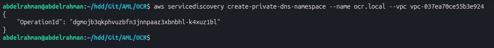

- we use the VPC that we are created. 


# Tasks 


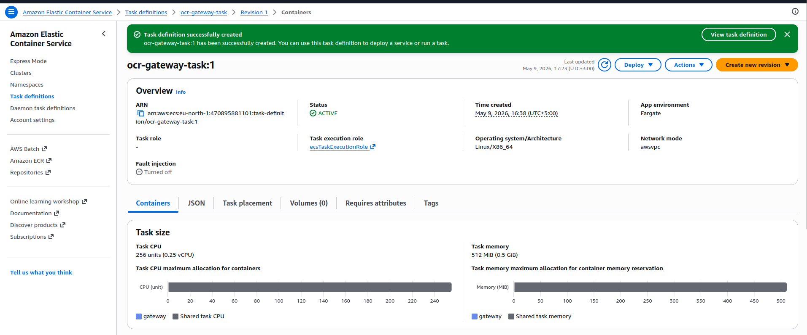


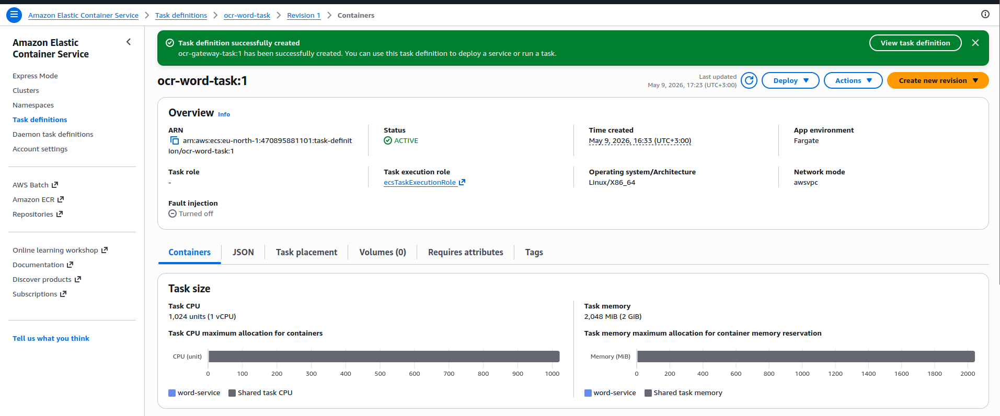


# Create Services : on Cluster 

Step 1: Create the Character Service
   1. Go to your Cluster (ocr-cluster).
   2. In the Services tab, click Create.
   3. Deployment configuration:
       * Family: ocr-character-task
       * Service name: character-service
       * Desired tasks: 1
   4. Networking:
       * Security groups: Select ocr-tasks-sg.
   5. Service discovery: (This is the important part!)
       * Check "Use service discovery".
       * Namespace: ocr.local.
       * Service discovery name: character-service (Matches the URL we gave the gateway).
   6. Click Create.


---
 Step 2: Create the Word Service
   1. Go back to the cluster and click Create again.
   2. Deployment configuration:
       * Family: ocr-word-task
       * Service name: word-service
       * Desired tasks: 1
   3. Networking:
       * Security groups: Select ocr-tasks-sg.
   4. Service discovery:
       * Check "Use service discovery".
       * Namespace: ocr.local.
       * Service discovery name: word-service.
   5. Click Create.

---
Step 3: Create the Gateway Service (The Frontend)
   1. Click Create one last time.
   2. Deployment configuration:
       * Family: ocr-gateway-task
       * Service name: gateway-service
       * Desired tasks: 1
   3. Networking:
       * Security groups: Select ocr-tasks-sg.
   4. Load balancing:
       * Load balancer type: Application Load Balancer.
       * Load balancer: Select ocr-alb.
       * Container: gateway:8000.
       * Target group: Select ocr-gateway-tg.
   5. Click Create.
---


### we will need task definition & security group & service-discovery (namespace) & VPC in this service .


## Character Service : 

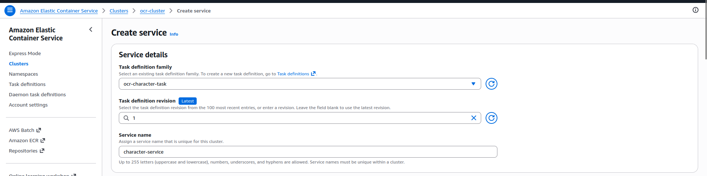


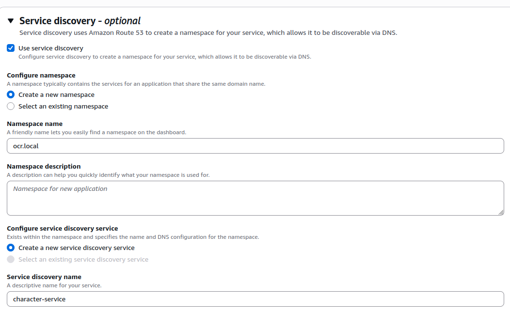


-- We don't need load balancer here : Note . it's backend service, not our gateway .


## Word Service : 


- as **character service**


## Gateway service
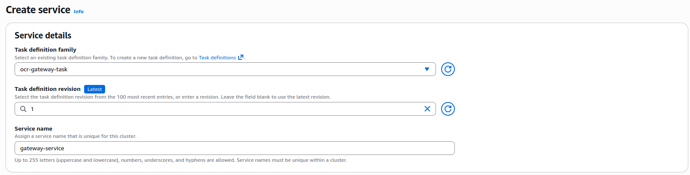


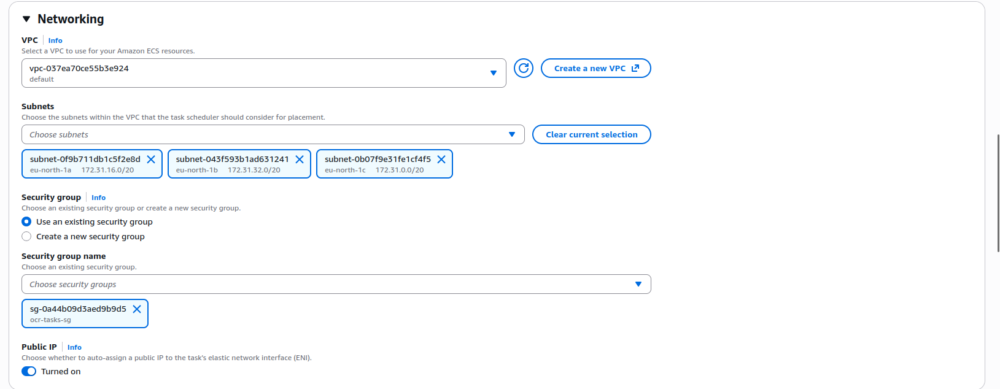


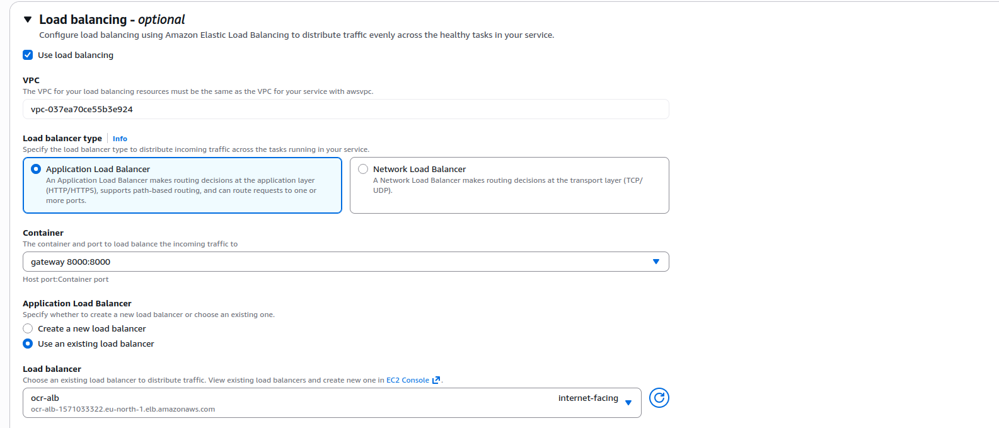
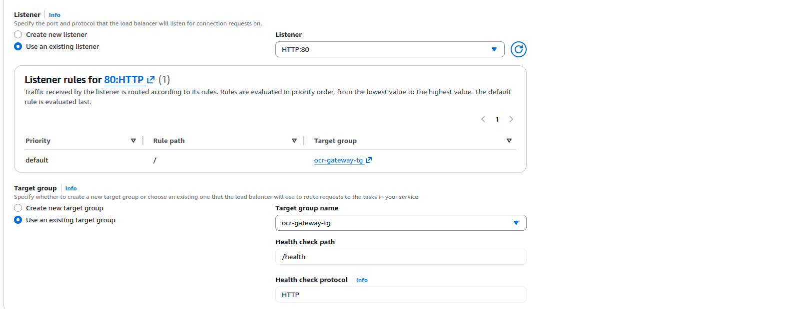


# Make sure check the **variables** in gateway task to match the code : 

* Key : CHARACTER_SERVICE_URL : 
* Value :http://character-service.ocr.local:8001

* Key: WORD_SERVICE_URL
* Value : http://word-service.ocr.local:8002


## Also make sure to check all 3 regions in gateway task , the load balancer need eu-north-c . 